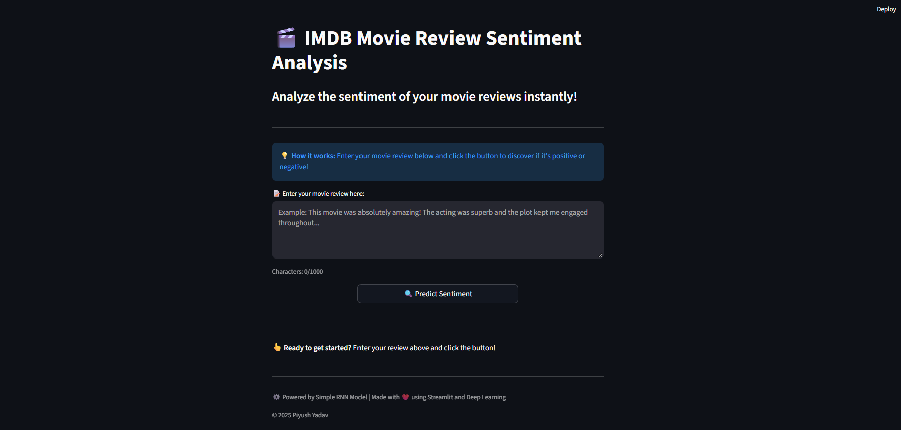
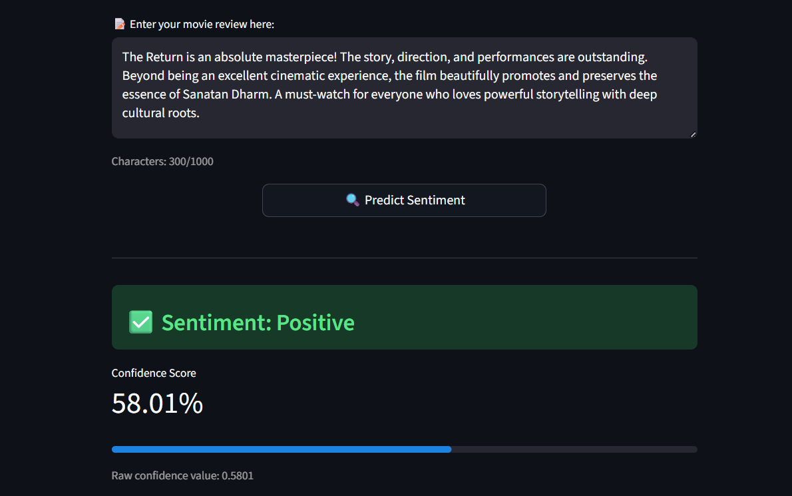
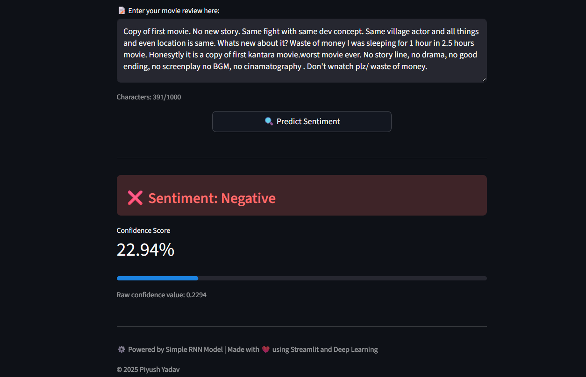

# 🎬 Movie Review Sentiment Analysis
  - Sentiment analysis models for movie reviews using Recurrent Neural Networks.
  - Sentiment Analysis is a major application of Natural Language Processing (NLP).

  

## Overview
This repository contains RNN-based models for classifying movie reviews as positive or negative using the IMDB dataset.

## Models
- **Simple RNN** - Basic recurrent neural network implementation
- other models will be added....

## Features
- Text preprocessing pipeline
- Model training and evaluation
- Interactive Streamlit web app for real-time predictions

## Usage
```bash
streamlit run app.py
```

## Dataset
  IMDB Movie Reviews Dataset (50,000 reviews)

## Requirements

 - TensorFlow/Keras
 - Streamlit
 - NumPy
 - Pandas

## Screenshots
### Main Dashboard

   

### Positive Prediction

   

### Negative Prediction

   
 
## Future Work

- LSTM implementation
- GRU implementation
- Bidirectional RNN variants
